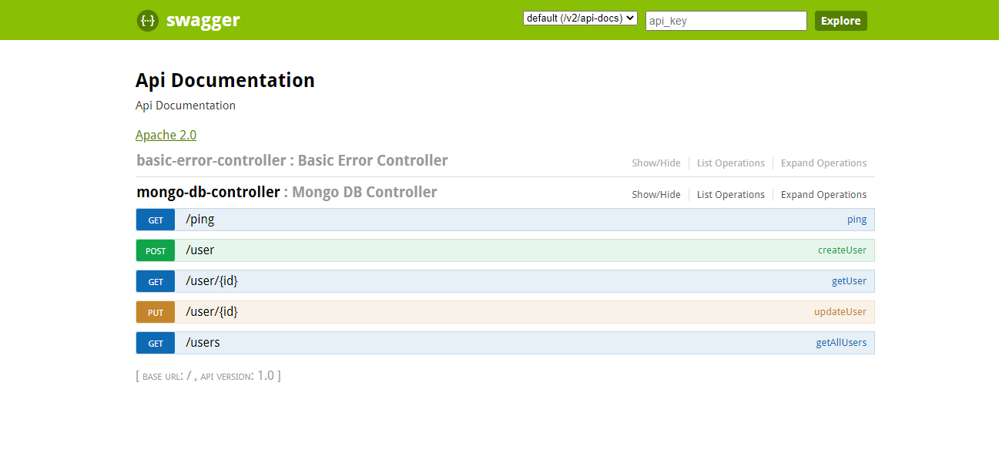

# mongo-db-demo

## Local setup
1. git clone
2. Run below commands <br />
   ```
   cd <project-dir>
   mvn package 
   java -jar <jar file path> 
   ```
3. Open Swagger url in broswer
   http://localhost:8080/swagger-ui.html <br />
   You will see below UI and you can test all api's <br /><br />


## Mongo DB setup
1. [Download and install](https://www.mongodb.com/try/download/community) mongo DB 
2. Steps to start mongo DB server on Windows
	- Go to Control Panel and click on Administrative Tools.
	- Double click on Services. A new window opens up.
	- Search MongoDB.exe. Right click on it and select Start.monb
3. [Download](https://www.mongodb.com/try/download/compass) Mongo DB Compass dashboard

## Technology
1. Springboot
2. Mongo DB
3. Swagger

Reference: https://www.technicalkeeda.com/spring-tutorials/spring-4-mongodb-repository-example
